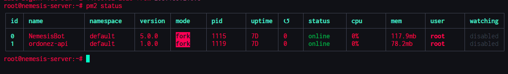
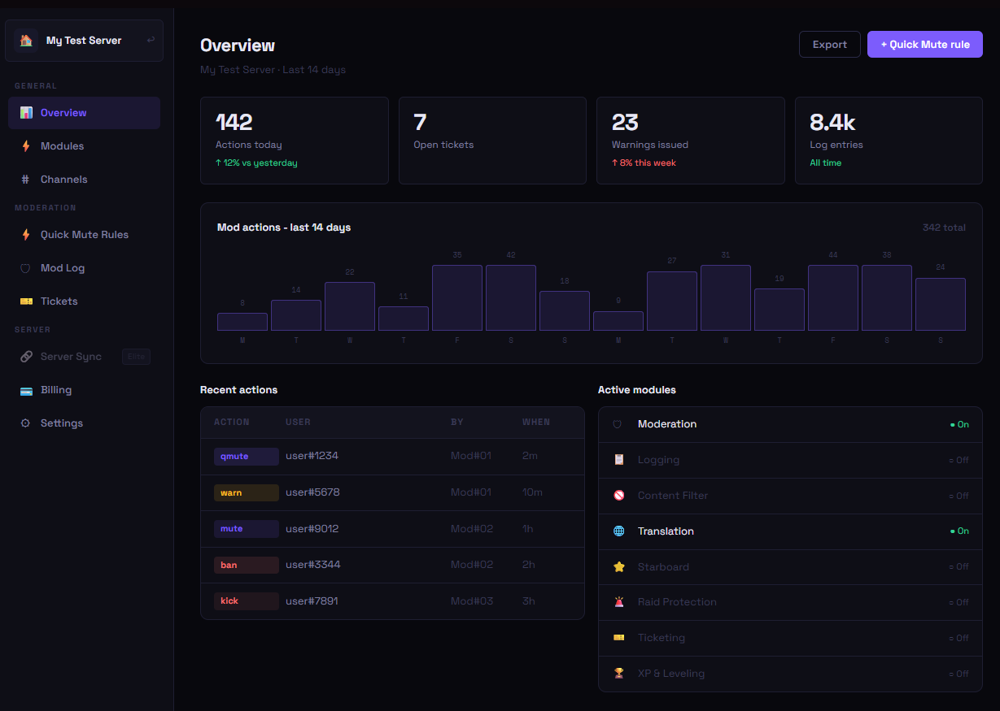
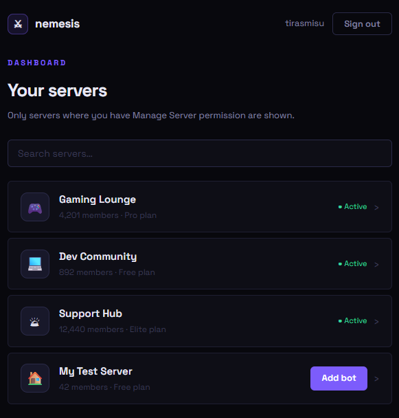
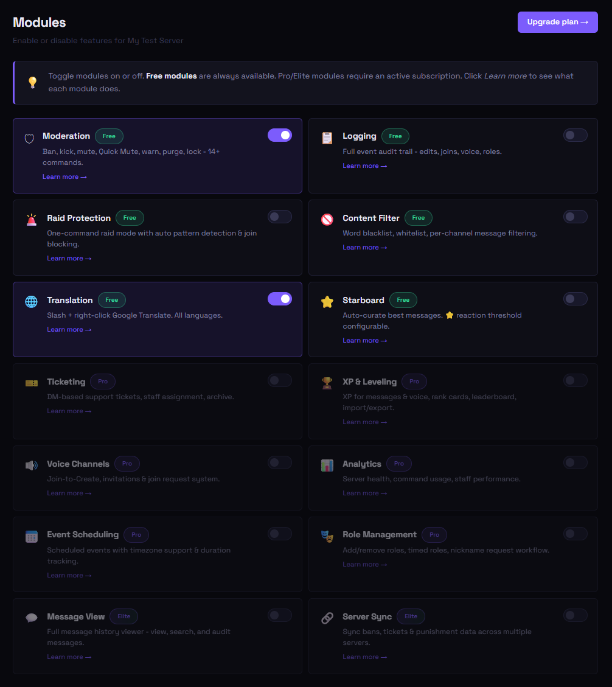
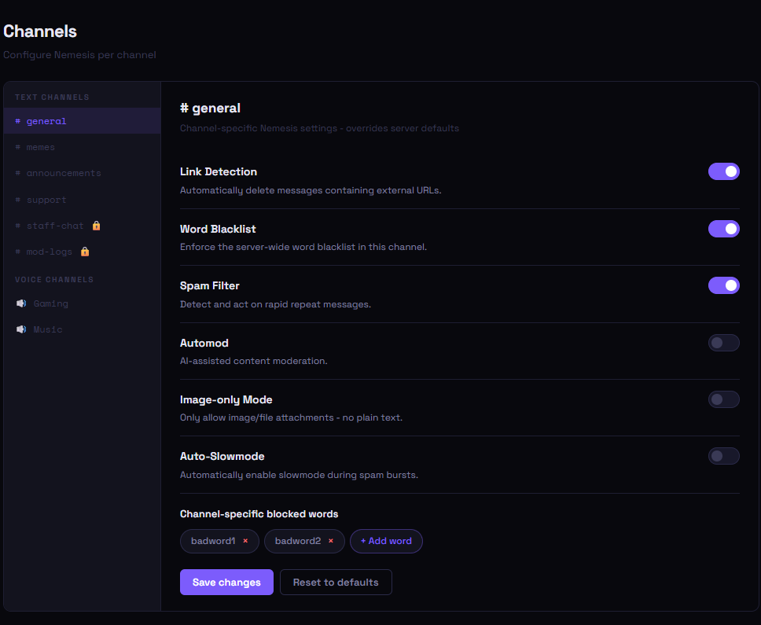
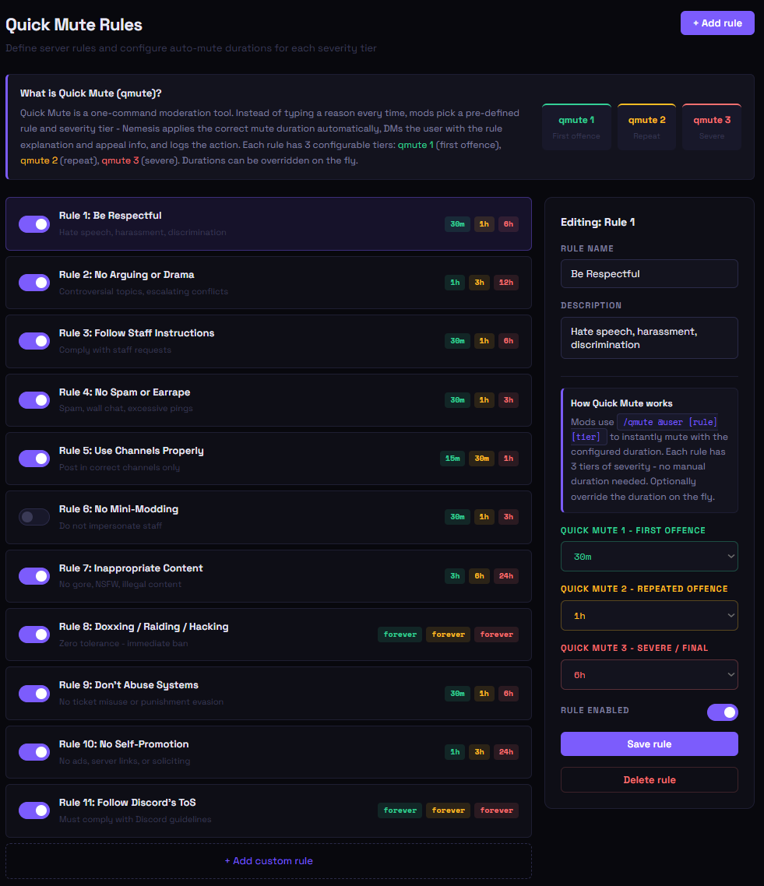
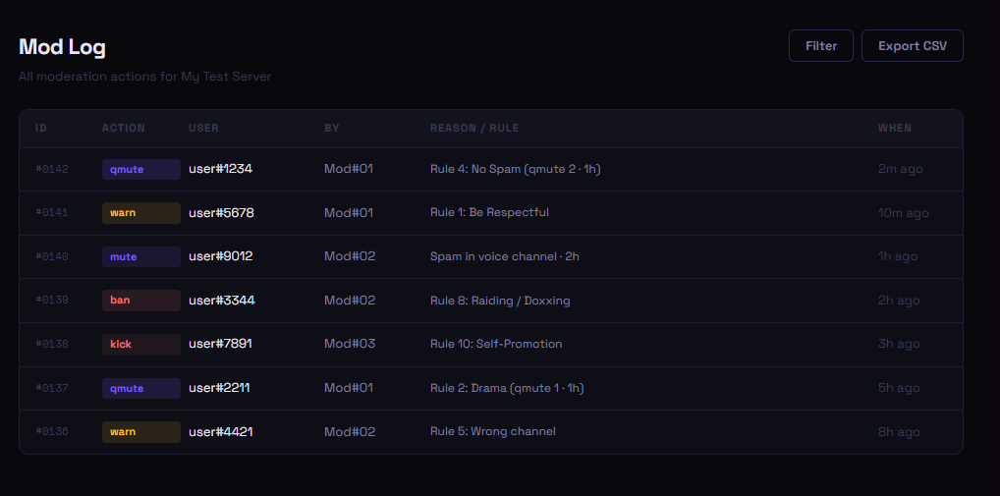
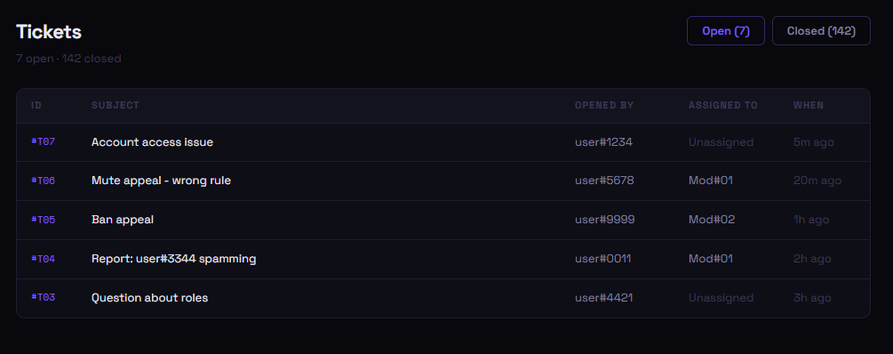

# Nemesis: System Architecture & Documentation

> **Note:** This repository serves as the public architecture and system design showcase for Nemesis. The core application repository is maintained privately for security and operational integrity.

## Overview
Nemesis is a production-grade, event-driven moderation platform built to handle real-time asynchronous data streams. It currently scales to support over 28,600+ users, utilizing a highly modular class-based architecture to ensure reliable performance, automated security, and 24/7 uptime.

## Tech Stack & Infrastructure
* **Backend:** Node.js, Discord.js (Gateway API)
* **Database:** MongoDB (Relational state schemas), Local JSON (High-throughput transactional caching)
* **Infrastructure:** Self-hosted Linux, Docker, PM2 Process Management
* **Testing:** Jest, Rust (Regression testing)

## Engineering Highlights

### Modular Command Architecture
Engineered a scalable command hierarchy pattern utilizing custom class inheritance (`BaseCommand` and `ModerationCommand`). This abstracts validation, error handling, permission checks, and performance logging across 55+ independent feature modules, ensuring strict DRY (Don't Repeat Yourself) principles.

### Event-Driven Processing
Implemented 18 distinct event handlers to process asynchronous interactions via webhooks and API gateways. Tracks and manages state changes to power automated voice channel management and dynamic user leveling.

### Data Persistence Layer
Designed a hybrid data persistence layer. Uses MongoDB with targeted indexing to accelerate real-time data retrieval for moderation logs and ticket data, while leveraging local storage caching for time-sensitive, high-frequency operations.

## Application Interfaces & Infrastructure

### 1. Production Environment (Live)
Nemesis is deployed on a self-hosted Linux environment, utilizing PM2 for process management and zero-downtime restarts.

### 2. Web Dashboard UI (Frontend Prototype)
Designed a modern, responsive frontend interface to visualize real-time moderation analytics, manage ticket routing, and configure active modules. The UI prototype establishes the data structure for the upcoming REST API integration.

### 3. Dashboard UI Prototypes & Feature Mapping
Developed high-fidelity frontend prototypes to visualize the data structure and user flow for the REST API integration. These mockups demonstrate the administrative controls for the backend moderation logic:

**Multi-Tenant Server Management:** Entry point for users to manage multiple Discord guilds with distinct subscription tiers and permission validations.

**Modular Configuration:** Granular toggle system for server administrators to enable/disable specific event listeners and bot features.

**Granular Channel Control:** Per-channel overrides for global server settings, allowing distinct automod parameters (like link detection and image-only modes) based on channel context.

**Dynamic Rule Engine:** Interface for the Quick Mute architecture, allowing users to configure custom punishment tiers and asynchronous timeout durations.

**Data Visualization:** Dashboard views for real-time moderation logs and active support tickets queried from the MongoDB database.

